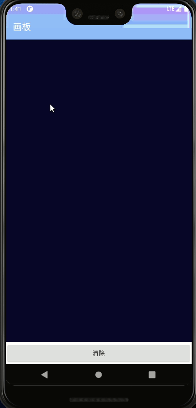

# Android & Kotlin：通过实现画板App学习onTouchEvent


`onTouchEvent`和`onClick`是不同的事件，click只是点击一次，`onTouchEvent`是观察整个touch过程。

## 0.效果展示




## 1. 布局

### 1.1 RelativeLayout

之前都是使用`LinearLayout`进行布局，还有一种布局使用也挺多的：`RelativeLayout`，可以通过相对定位的方式让控件出现在布局的任何位置。

通过描述跟父组建或是其他组建关系进行布局，如下为布局使用设置：


|  layout_alignParentTop   | 如果指定为“ true”，则视图的上边缘将与父对象的上边缘匹配。 |
| :----------------------: | :-------------------------------------------------------: |
| layout_alignParentBottom | 如果指定为“ true”，则视图的下边缘将与父对象的下边缘匹配。 |
|  layout_alignParentLeft  | 如果指定为“ true”，则视图的左边缘将与父对象的左边缘匹配。 |
| layout_alignParentRight  | 如果指定为“ true”，则视图的右边缘将与父对象的右边缘匹配。 |
|  layout_centerInParent   |       如果指定为“ true”，则视图将与父级的中心对齐。       |
| layout_centerHorizontal  |   如果指定为“ true”，则视图将在其父视图内水平居中对齐。   |
|  layout_centerVertical   |   如果指定为“ true”，则视图将在其父视图内垂直居中对齐。   |
|       layout_above       | 它接受另一个同级视图ID，并将视图放置在指定的视图ID上方。  |
|       layout_below       | 它接受另一个同级视图ID，并将视图放置在指定的视图ID之下。  |
|     layout_toLeftOf      | 它接受另一个同级视图ID，并将视图放置在指定视图ID的左侧。  |
|     layout_toRightOf     | 它接受另一个同级视图ID，并将视图放置在指定视图ID的右侧。  |
|     layout_toStartOf     | 它接受另一个同级视图ID，并将视图放置到指定视图ID的开头。  |
|      layout_toEndOf      | 它接受另一个同级视图ID，并将视图放置在指定视图ID的末尾。  |


### 1.2 使用

+ 这个例子的布局都很简单，就是一个画板一个清楚按钮
+ `ProgressBar`可以可无，目前没有联网或是加载的内容
+ 在底部创建一个button
+ DrawView画布设定在button之上

```xml
<RelativeLayout xmlns:android="http://schemas.android.com/apk/res/android"
        xmlns:app="http://schemas.android.com/apk/res-auto"
        xmlns:tools="http://schemas.android.com/tools"
        android:layout_width="match_parent"
        android:layout_height="match_parent"
        tools:context=".MainActivity"
        android:orientation="vertical"
    >
    
    <ProgressBar
        android:id="@+id/loading_progress"
        style="?android:attr/progressBarStyleLarge"
        android:layout_width="wrap_content"
        android:layout_height="wrap_content"
        android:layout_centerInParent="true"
        android:gravity="center"
    />


    <com.ffzs.draw.myCanvas.DrawView
        android:id="@+id/paintView"
        android:layout_width="match_parent"
        android:layout_height="wrap_content"
        android:layout_above="@+id/clear"
        android:background="@android:color/black"
    />

    <Button
        android:id="@+id/clear"
        android:layout_width="match_parent"
        android:layout_height="wrap_content"
        android:layout_alignParentBottom="true"
        android:text="清除"
    />

</RelativeLayout>
```

## 2. 画布实现

逻辑也挺简单的，创建一个view，放一个黑背景，然后通过`onTouchEvent`进行观察，将touch的路径记录成path，通过其他颜色显示出来。

### 2.1 画板实现

+ 通过DisplayMetrics获取显示情况，主要是用来获取机器长宽等信息

```kotlin
val metrics = resources.displayMetrics
```

+ 然后通过大小生成对应的canvas
+ 通过RectF构建矩形区域

```kotlin
fun init(metrics: DisplayMetrics) {
    val width = metrics.widthPixels
    val height = metrics.heightPixels / 10 * 9
    maxBound = Bound()
    bitmap = Bitmap.createBitmap(width, height, Bitmap.Config.ARGB_8888)
    canvas = Canvas(bitmap!!)
}
```

### 2.2 画笔实现

通过Paint实现画笔，相应设置：

```kotlin
paint.isAntiAlias = true
paint.isDither = true
paint.color = canvanBgColor
paint.style = Paint.Style.STROKE
paint.strokeJoin = ROUND
paint.strokeCap = Paint.Cap.ROUND
paint.alpha = 0xff
```

## 3. 绘画实现

通过`onTouchEvent`对绘画过程进行观察，`MotionEvent`的类型很多这里只用到：

+ 开始（按下） `ACTION_DOWN`
+ 移动 ACTION_MOVE
+ 结束（抬起）ACTION_UP

```kotlin
when (event.action) {
    MotionEvent.ACTION_DOWN -> {
        touchStart(x, y)
        invalidate()
    }
    MotionEvent.ACTION_MOVE -> {
        touchMove(x, y)
        invalidate()
    }
    MotionEvent.ACTION_UP -> {
        touchUp()
        invalidate()
    }
}
```

### 3.1 开始

开始阶段创建一个新的path记录，将位置`moveTo`触摸点，并将path加入到paths中

```kotlin
private fun touchStart(x: Float, y: Float) {
    if (x < 0 || x > canvas!!.width || y < 0 || y > canvas!!.height) {
        return
    }
    path = Path()
    paths.add(path!!)
    path!!.reset()
    path!!.moveTo(x, y)
    xx = x
    yy = y
}
```

### 3.2 移动

+ `touchGas`设置一个记录移动的最小距离，移动距离超过的话会将移动路径写入path中
+ 因为是记录一段是两个点，因此去中间位置记录，因为结束位置下一次记录会写入

```kotlin
private fun touchMove(x: Float, y: Float) {
    if (x < 0 || x > canvas!!.width || y < 0 || y > canvas!!.height) {
        return
    }

    val dx = abs(x - xx)
    val dy = abs(y - yy)
    if (dx >= touchGas || dy >= touchGas) {
        path!!.quadTo(xx, yy, (x + xx) / 2, (y + yy) / 2)
        xx = x
        yy = y
    }
}
```

### 3.3 结束

+ 通过`lineTo`结束path

```kotlin
private fun touchUp() {
    path!!.lineTo(xx, yy)
    maxBound!!.add(Path(path))
}
```

### 3.4 展示

通过`onDraw`方法将path通过paint绘制到canvas上：

```kotlin
override fun onDraw(canvas: Canvas) {
    canvas.save()
    this.canvas!!.drawColor(canvanBgColor)
    for (path in paths) {
        paint.color = canvasPaintColor
        paint.strokeWidth = brushSize
        this.canvas!!.drawPath(path, paint)
    }
    canvas.drawBitmap(bitmap!!, 0f, 0f, bitmapPaint)
    canvas.restore()
}
```

### 3.5 清除

+ 清空paths
+ 重新设置画板

```kotlin
fun clear() {
    paths.clear()
    maxBound = Bound()
    invalidate()
}
```


## 4.心得

现在只实现一个很简单的功能，还可以添加很多功能：

+ 画笔换颜色
+ 画笔换粗细
+ 保存成为图片
+ 分享图片


## 5.源码

github